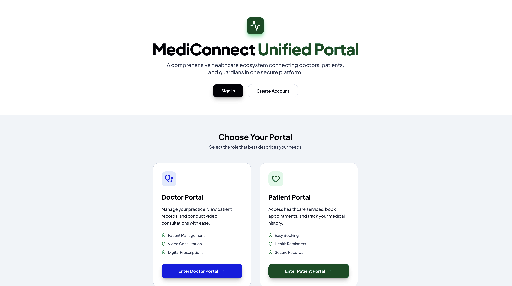
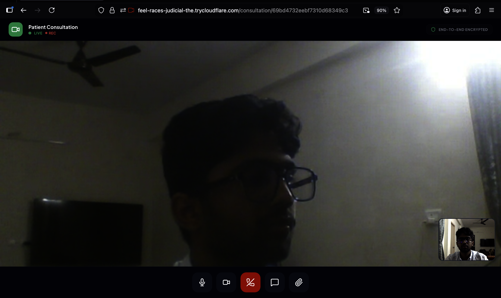
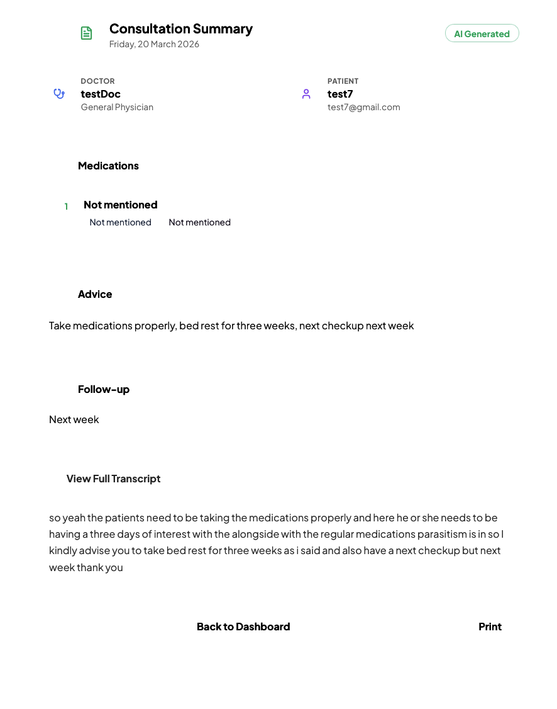
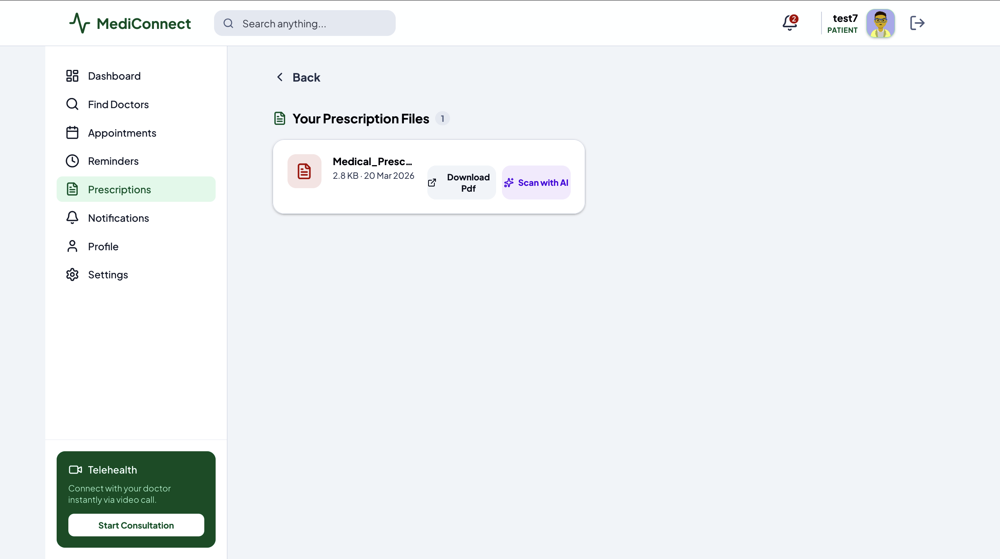

# 🏥 MediConnect – AI-Powered Healthcare Consultation Platform

<div align="center">


</div>

---

## 🚀 Overview

**MediConnect** is an AI-driven healthcare platform that transforms doctor-patient consultations into structured medical intelligence.

It records consultations, transcribes conversations, and generates AI-powered summaries to improve treatment continuity and decision-making.

🌐 Live App: medi-connect-neon-nine.vercel.app
---

## 🎥 Demo Video

<div align="center">
Click in the image


[](https://youtu.be/TryiEVjrxSo)

</div>

---

## 📸 Screenshots(Sample)

### 🎥 Video Consultation Interface


### 🧠 AI Summary Generation


### 📎 Prescription Upload


---

## 🎯 Problem Statement

Healthcare consultations often lack structured documentation, leading to:

- 📉 Poor patient history tracking
- 🔁 Repeated diagnosis efforts
- 📢 Miscommunication between visits

---

## 💡 Solution

MediConnect introduces a **Consultation Intelligence Layer** that:

- 🎙️ Captures consultation audio
- 📝 Converts speech to text
- 🧠 Generates structured medical summaries
- 🗃️ Stores and retrieves patient history

---

## ✨ Key Features

### 🎥 Video Consultation
- Real-time doctor-patient interaction
- Integrated chat system

### 🎤 Audio Recording & Transcription
- Records consultation audio
- Converts speech to text using **Whisper**

### 🧠 AI Medical Summarization
Extracts structured data including:
- Chief Complaint
- Symptoms
- Diagnosis
- Medications
- Advice
- Follow-up

### 📄 Consultation History
- Persistent medical records
- Easy retrieval for future visits

### 📎 Prescription Management
- Upload and share prescriptions
- Patient access to prescriptions

---

## 🏗️ Tech Stack

| Layer | Technologies |
|-------|-------------|
| **Frontend** | React (Vite), Tailwind CSS, Axios, Socket.IO,vercel |
| **Backend** | Node.js, Express.js, MongoDB (Mongoose),render|
| **AI & APIs** | Groq API (LLaMA 3.1), Whisper (Speech-to-Text) |

---

## 🔄 Workflow

```
Doctor-Patient Call
        ↓
Audio Recording
        ↓
Speech-to-Text (Whisper)
        ↓
AI Summarization (Groq LLaMA)
        ↓
Structured JSON Output
        ↓
Stored in Database
        ↓
Displayed in UI
```

---

## 📂 Project Structure

```
health-backend/
├── controllers/
├── models/
├── routes/
├── middleware/
├── uploads/
└── server.js

src/
├── components/
├── pages/
├── services/
├── context/
└── App.jsx
```

---

## 🔐 Authentication

- JWT-based authentication
- Role-based access: **Doctor / Patient / Guardian**

---

## 🌍 SDG Alignment

| SDG | Goal | How MediConnect Helps |
|-----|------|-----------------------|
| 🌱 SDG 3 | Good Health and Well-being | Improves healthcare accessibility and continuity |
| 🏭 SDG 9 | Industry, Innovation and Infrastructure | Applies AI in healthcare |
| ⚖️ SDG 10 | Reduced Inequalities | Supports remote consultations |

---

## 🚀 Future Enhancements

- 📊 Patient timeline visualization
- ⚠️ AI-powered health alerts
- 🧾 Auto-generated prescriptions (PDF)
- 🧠 Real-time transcription
- 🤖 AI doctor assistant

---

